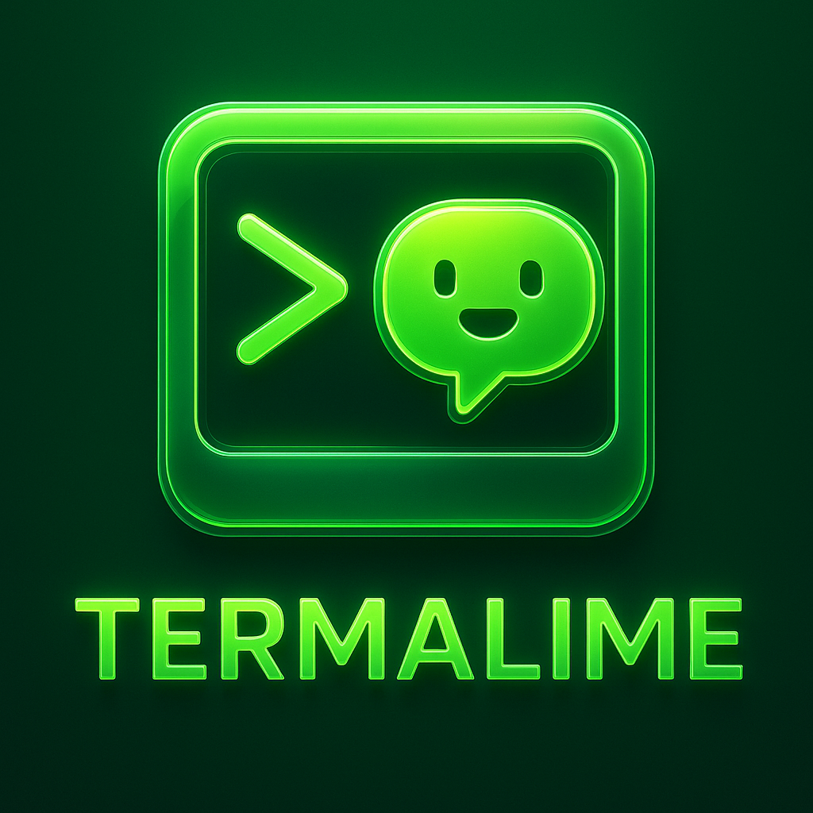

# Termalime

Termalime is a Tauri-powered desktop cockpit that fuses a full terminal emulator with an AI chat console. It’s built for developers who constantly bounce between shell sessions and AI prompts—everything lives in a single split-pane workspace with a polished lime-dark aesthetic.



## ✨ Features

- **Split terminal + AI chat:** Resizable panes keep shell output and assistant replies side-by-side.
- **Persistent sessions:** PTY sessions stay alive while you prompt the model, perfect for iterative workflows.
- **Hover controls:** Copy/delete chat messages instantly via subtle on-hover actions.
- **Custom branding:** Lime splash screen, dock/taskbar icon, and packaging metadata branded as “Termalime”.
- **Linux desktop bundles:** One command emits `.deb`, `.rpm`, and AppImage artifacts for distribution.

## 🧱 Tech stack

- **Frontend:** React + Vite + Tailwind/Tauri styles
- **Desktop shell:** Tauri 2.x (Rust backend with WebKit WebView)
- **Terminal subsystem:** `portable-pty` + custom PTY registry for multi-session terminal streams
- **AI bridge:** Streams chat responses from local Ollama models via async reqwest client

## 🚀 Development workflow

```bash
npm install
npm run tauri dev
```

> **Linux tip:** if GTK/WebKit headers aren’t detected, prefix dev/test commands with `PKG_CONFIG_PATH=/usr/lib/x86_64-linux-gnu/pkgconfig:/usr/share/pkgconfig:$PKG_CONFIG_PATH` (same for `cargo check`).

### Splash + icon tweaks

- Splash markup lives in `index.html`, styling in `src/index.css`.
- Runtime window icon logic sits in `src-tauri/src/lib.rs` (clones `app.default_window_icon()` so the dock shows the lime badge).
- Regenerate icons with `npm run tauri icon ./assets/logo.png` and confirm references inside `src-tauri/tauri.conf.json`.

## 🧪 Production build

```bash
npm run tauri build
```

This runs the Vite build (`dist/`) and feeds it to the Tauri bundler.

## 📦 Packaging & installation (Ubuntu example)

1. Install native deps once:

```bash
sudo apt update
sudo apt install -y libgtk-3-dev libwebkit2gtk-4.0-dev build-essential curl wget pkg-config libssl-dev
```

2. Build the bundles:

```bash
PKG_CONFIG_PATH=/usr/lib/x86_64-linux-gnu/pkgconfig:/usr/share/pkgconfig:$PKG_CONFIG_PATH npm run tauri build
```

3. Install the `.deb` locally:

```bash
sudo apt install ./src-tauri/target/release/bundle/deb/Termalime_0.1.0_amd64.deb
```

Artifacts land under `src-tauri/target/release/bundle/`:

- `deb/Termalime_0.1.0_amd64.deb` → install with `apt`
- `appimage/Termalime_0.1.0_amd64.AppImage` → `chmod +x` then run directly
- `rpm/Termalime-0.1.0-1.x86_64.rpm` → for Fedora/RHEL friends

Adjust `bundle.targets` or metadata inside `src-tauri/tauri.conf.json` if you only need specific formats or want to bump versions.
